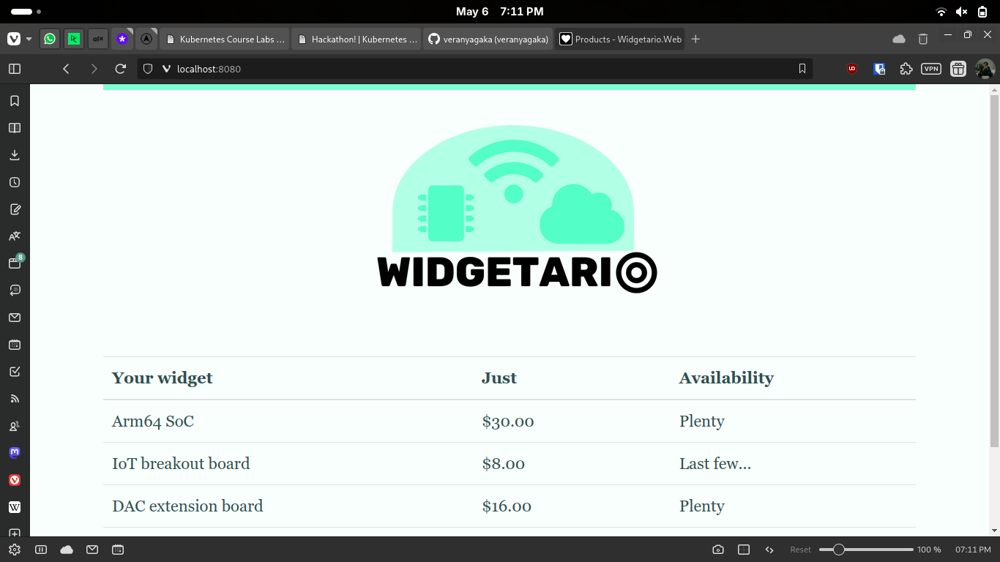

# Part 1 - Welcome to Widgetario

## Commands run
```bash
kubectl apply -f k8s-hackathon/part1/products-api.yml -f k8s-hackathon/part1/products-db.yml -f k8s-hackathon/part1/stock-api.yml -f k8s-hackathon/part1/web.yml

kubectl get pods 

kubectl port-forward svc/web 8080:80
```

