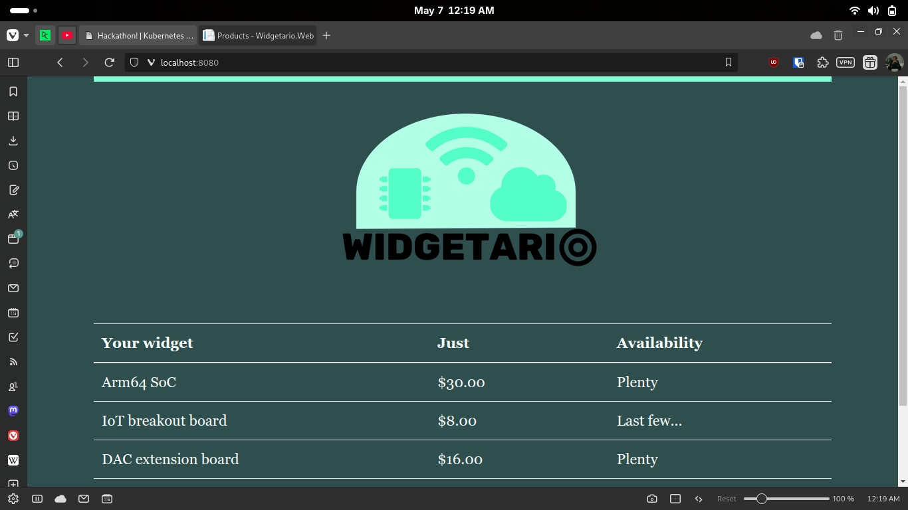

# Part 2 - Configuration

## Commands run
```bash

kubectl apply -f kubernetes-hackathon/part1/products-api.yml -f kubernetes-hackathon/part1/products-db.yml -f kubernetes-hackathon/part1/stock-api.yml -f kubernetes-hackathon/part1/web.yml

kubectl get pods 

kubectl port-forward svc/web 8080:80
```

