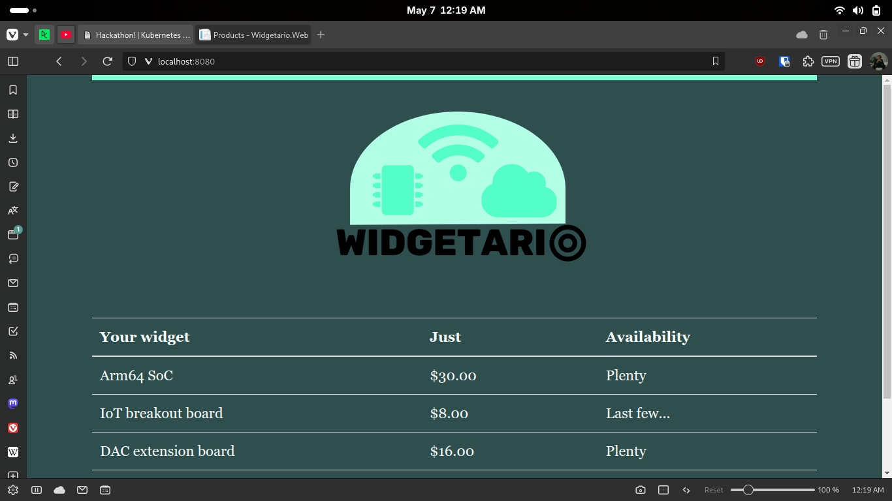

# Part 2 - Configuration

## Commands run
```bash
kubectl delete deploy products-db
kubectl delete svc products-db

kubectl apply -f kubernetes-hackathon/part3/products-api.yml -f kubernetes-hackathon/part3/products-db.yml -f kubernetes-hackathon/part3/stock-api.yml -f kubernetes-hackathon/part3/web.yml

kubectl rollout restart deploy/products-api deploy/stock-api
```

