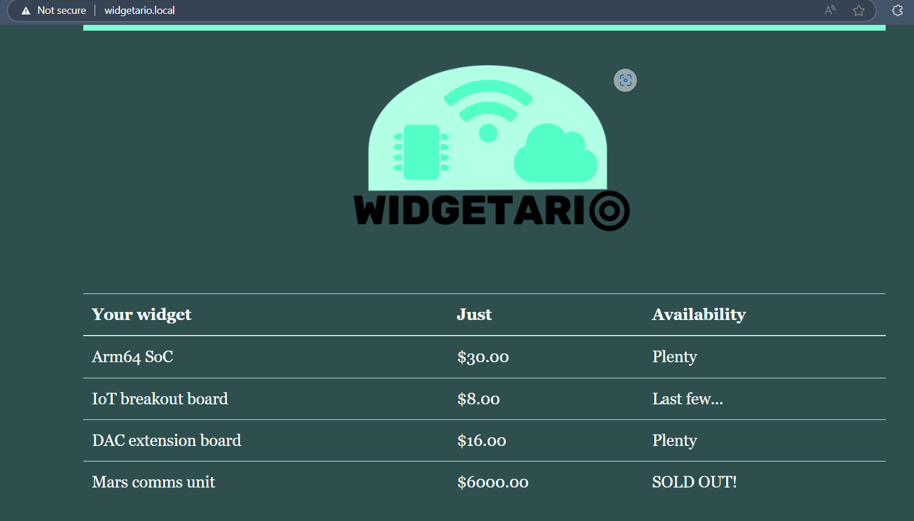

# Part 2 - Configuration

## Commands run
deploy the official NGINX Ingress controller using this command:
```bash
kubectl apply -f https://raw.githubusercontent.com/kubernetes/ingress-nginx/controller-v1.9.6/deploy/static/provider/cloud/deploy.yaml
```
Wait for the controller to become ready:
```bash
kubectl get pods -n ingress-nginx
```

Create ingress.yaml
```bash
kubectl apply -f part4/ingress.yaml
```
Run notepad as administrator and navigate to C:\Windows\System32\drivers\etc\
Add the following lines at the bottom:
127.0.0.1 widgetario.local
127.0.0.1 api.widgetario.local

Access the Application
Open http://widgetario.local for the web UI.

Open http://api.widgetario.local/products for the products API.

