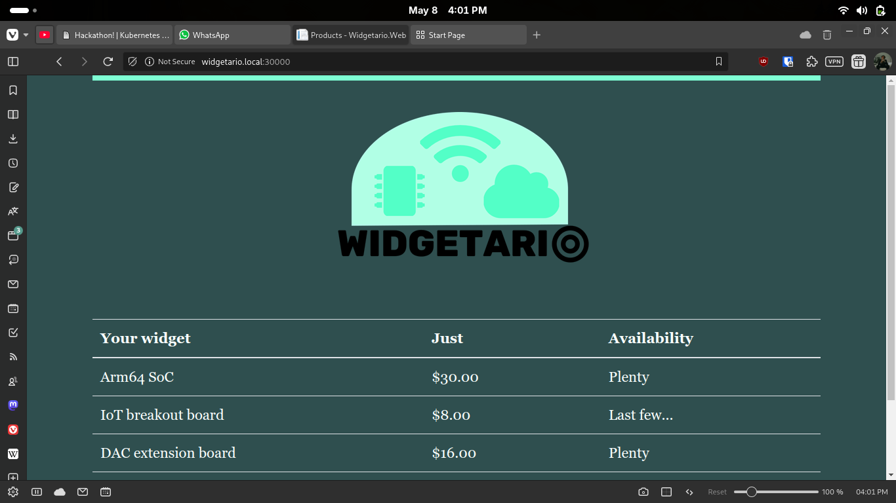

# Part 4 - Ingress

## Commands Run
```bash

kubectl apply -f ingress-controller.yaml

kubectl get pods -n ingress-nginx  

kubectl apply -f ingress.yaml

sudo nano /etc/hosts  

# or
# Windows (run as Admin)
./scripts/add-to-hosts.ps1 widgetario.local 127.0.0.1
./scripts/add-to-hosts.ps1 api.widgetario.local 127.0.0.1

# Linux/macOS
./scripts/add-to-hosts.sh widgetario.local 127.0.0.1
./scripts/add-to-hosts.sh api.widgetario.local 127.0.0.1

curl -H "Host: widgetario.local" http://192.168.49.2:30000
```

